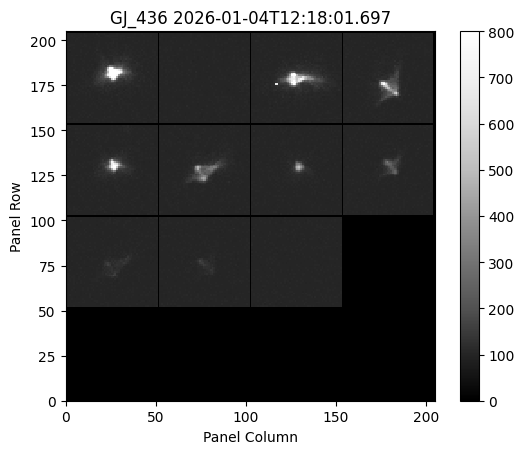

# `reshape` Module

Pandora VisSci data is made up of many ROIs. In the raw science data these ROIs are made up of insets of images. We call this image of multiple insets a "panel", see an example below.

Panels are valuable for visualization, and have an optional 1 pixel border of padding to differentiate each inset. The functions in this module enable the user to switch between "panel" format and other formats. The formats are

1. *Panels*: Panel format consist of many ROIs inset into a single image and is 2-dimensional. There are always the same number of ROIs $n$ on the columns and on the rows within the panel. If there are fewer ROIs than $n^2$ then the remaining insets will have 0s in them. The panels can optionally have a 1 pixel border which will be zero.
2. *Cube*: Cube format consists of the same insets, but as 4-dimensional array. The cube will have shape ($n$, $n$, ROI_size, ROI_size) so that the user can index into each inset. Any insets that are zero in the *panel* format will be zero in the cube format. There is no border in the cube format.
3. *Array*: Array format is 3-dimensional array that has shape (nROI, ROI_size, ROI_size). Unlike the other two formats, no part of this array is "empty".

In the case that the data has a "time" dimension the number of dimensions will be increased by 1 and the first dimension will always be time.

### `reshape` Module API Documentation

::: pandorafits.reshape
    selection:
        docstring_style: numpy
        members:
            - list_to_panels
            - panels_to_cube
            - cube_to_list
            - panels_to_list
    options:
        show_root_heading: false
