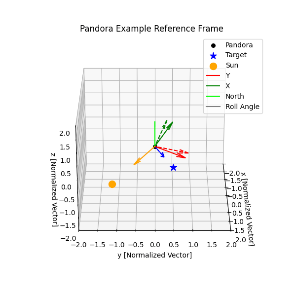

# `roll` Module

The roll of the spacecraft describes the angle around the boresight and so is an important part of predicting where stars will land in the detector images. The roll of the spacecraft is commanded, but Pandora flight rules dictate what the roll must be to ensure that the Pandora spacecraft is power positive. The gif below shows a schematic of the Pandora flight rules for roll.

The Pandora flight rule for roll is:

1. The spacecraft boresight must point towards the target. This is the `z` direction.
2. The solar panels of Pandora must point towards the cross product of the target vector and the sun vector. This ensures that the solar panels achieve maximum sunlight. This is the `y` direction.
3. The remaining `x` direction will point towards the cross product of the `z` and `y` dimensions.

The function in this module `get_roll` is designed to return the roll that the SOC would target if they obey the above flight rule. Currently there is no round trip of the **commanded** roll back to the ground. In the event that the pipeline has no information on what the commanded roll was, this function can be used to estimate what roll is likely to have been used.

### `roll` Module API Documentation

::: pandorafits.roll
    selection:
        docstring_style: numpy
        members:
            - get_roll
    options:
        show_root_heading: false
